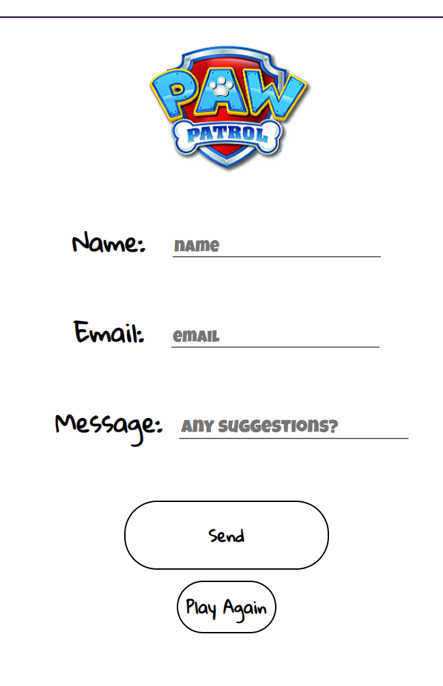

# Paw Patrol Kids Quiz

Active Link: https://ajorgensen89.github.io/pawpatrolquiz 

The purpose of this website is to design a Quiz using Javascript as the object based computer programmers language, commonly used to create interactive effects within web browsers. The Quiz website has been aimed at children about the topic of `Paw Patrol`. However, anyone can enjoy the quiz if they would like too. A little bit of knowledge around the topic will help with getting a higher score.
 
HTML, CSS and JavaScript have been used together for this project to produce a multiple questioned Quiz.
***
***

### Table of Contents.

* [User Experience](#user-experience)
	- [Wireframe](#wireframe)
* [Design for User Experience](#design)
	- [Colour Scheme](#colour-scheme)
	- [Typography](#typography)
* [Features](#features)
* [Testing](testing.md)
* [Clone Website](#clone-website)
* [Deployment](#deployment)
* [Technologies](#technologies)

# User Experience
This 'Pub quiz' style website contains questions about a childrens popular Tv Series called `'Paw Patrol'`. They have a number of different series and a `Paw Patrol` movie too. 
It is aimed for anyone who loves `Paw Patrol`. Kids and all those parents that get sucked into watching it too. The quiz contains 60 questions with three multiple choice questions(1:, 2:, 3:) for the user to select from. These questions are randomly iterated through JavsScript for the user. So, if they were to play again, the next 10 questions they face, should be different. This hopefully should be a fun way of testing the user's knowledge about the `Paw Patrol franchise`. 
Littles pops of colour taken from the character called Everest, can be seen through-out the website. Along with images and a `Paw Patrol Logo`. This logo is displayed above and is the first thing the user will see when they access the website, helping them know who it is about.
# Design
[Am I Responsive](https://ui.dev/amiresponsive?url=https://ajorgensen89.github.io/pawpatrolquiz/index.html) was used to see how the webpage displays on different screens. 
 
Wesbites can always be viewed from [Chrome Developer Tools](https://developer.chrome.com/docs/devtools/) to check any features, styling or design. This can be accessed by _right clicking_ on any webpage and then selecting _Inspect_ to view the website. Viewing at different pixel widths and heights, as you would on different device, such as a Tablet or Mobile device, helps you to see the responsivenss of the website too.

### Colour Scheme
The colours for this wesbite are based on the character `Everest` from `Paw Patrol`. She is one of the main Puppies in the `Paw Patrol` that help people. She has purple fur and green and orange clothes. [Chrome Developer Tools](https://developer.chrome.com/docs/devtools/) can be accessed from a link or directly through the **Inspect** option when you right click on any website. 
**Everest Character**
Colours based on her clothing. 
 
**Colour Chart**
This was created by using [Chrome Developer Tools](https://developer.chrome.com/docs/devtools/) to view the colours used over the website. 
 
**Check Chart**
Another one, is checking if any CSS classes have been created but not used, helping to tidy up the code. Also, it can give a count of the media queries being useds. 

### Typography
Text font was choosen from [Google Fonts](https://fonts.google.com/)
* Gloria Hallelujah
* Luckiest Guy
 
The **Luckiest Guy** font has been used to make the _placeholder_ text stand out in the input sections. 
**Gloria Hallelujah** font has been used through-out the website as the main font. It portrays a joyful, scribbly childish style of writing to the site without looking to serious.
The contrast of the larger, uppercase **Luckiest Guy** Font in the input fields, can then make them stand out and seem important to the user. 

See the [Wireframe](#wireframe) for explanation of the layout of the website. This includes, _homepage_, _rules_ page, _quiz_ itself and _form_ page for suggestion submission.
***

[Back to Top](#paw-patrol-kids-quiz)

## Wireframe
To compile the wireframe, [Balsamiq](https://balsamiq.com/) was used and is shown in the images below for this section.
### Welcome page to start of quiz
A _username_ can be created before entering the game. From this page I orginally included the _rules_. However, as you shall see in [features](#features), I have put the _rules_ to play the quiz onto another page. Then from the _rules_ page, you can _enter_ the game.
 

### Levels and Quiz Page
This page was orginally created to hold the content of three different levels by a _button_ with different levels of difficulty. **Easy, medium and hard** would display a different number of questions to complete the quiz. The main quiz itself was to be shown below the level _buttons_ with an incrementing _correct_ and _incorrect_ tally score at the bottom of the page. It was getting abit too much for one single page. Changes were made to the final website as you will see.
 

### Form Page
Forms can hold a number of different sets of data for a _user_ to fill out. At the end of this quiz the _user_ will be able to fill in their _username_, an _email address_ and _suggestive comments_ back to a connected email service created on [Email JS](https://www.emailjs.com/).
 

### Back Form Page
This page was used to ensure when the user enters details to be submitted, they get sent to a **finish** page to signigfy the submission had been completed.
 

[Back to Top](#paw-patrol-kids-quiz)
***
# Features
The features and pages created in the final Pub Quiz game for a `Paw Patrol Quiz` are quite different to the original [wireframe from Balsamiq](https://balsamiq.com/) design that can be seen in the [User Experience](#user-experience) section. 
### Homepage
Consists of a Headtitle for the quiz. A username can be created from here by **clicking** the _Submit_ button. The **click** of the _Start Game!_ anchor, then takes you to the rules page. 
On the Homepage, you always have access to the Form page via _submit a suggestion_ button. 
Each page also has a [Font Awesome](https://fontawesome.com/) **Icon** of an igloo house which also takes you back to the Homepage from every _.html_ page connected to this quiz. 
 
### Rules page
This page holds the instrustions on how the quiz is set up and how it should be played. To enter the quiz you **click** the **Let's Go!** button. 
In the top left corner, a [Font Awesome](https://fontawesome.com/) **Icon** can be used to link back to the Home Page. 
 
### Quiz Questions
The Quiz itself presents ten different questions, all with three answers to choose from. An array of sixty questions can be iterated through so, the next time the user plays, different questions should be revealed to give varity to the Quiz if a user decides to play again. 
A feature has been added to the game to help the user keep track of what number question you are on at the top of the page. It shows as _1 of 10_, _2 of 10_, _3 0f 10_, all the way to _10 of 10_. 
In the top left corner, a [Font Awesome](https://fontawesome.com/) **Icon** can be used to link back to the Home Page. 
**Image shows all the quiz**
 
### Quiz Answers
Once the user has read the answer, they can answer by **clicking** on that answer they think to be **true** or **correct**. 
A _class_ is then applied from **CSS** by using **JavaScript** to the **clicked** answer. It then lights up either _green_ for **correct** or, _red_ for **incorrect**. 

### Question Number counter
Once the user has **clicked** on the answer they choose, a score counter counts the score of both **correct** and **incorrect** answers. At the end of the round of 10 questions and reachs _10 of 10_, the score is saved to the bottom of the Quiz page and the user can try the quiz again to see if they can beat this score. 

### Correct and Incorrect Scores with an Image
Aswell as seeing the score counters increase, an image is displayed with a correct and incorrect answer. The picture for a **correct** answer is a happy picture of `Everest`, a main character from `Paw Patrol`, as the user got the answer right. The **incorrect** answer selected, displays a sad picture of `Everest`, as the user made the wrong choice. 
**Image for correct answer** 
 

**Image for Incorect answer** 
 

### Previous Score
The score from the quiz gets taken and saved to the bottom of the page in **Previous Score** so, the user can view this score if they choose to beat it with another round of ten questions.
### Submission Form
The form page contains the ability for the user to enter a username, email and suggestion about the quiz which gets sent through [Email JS](https://www.emailjs.com/) via this service, for the creater of the website to receive the responses sent. 
The **send** button works by a **click function** and sends the user to a final page that confirms the information they entered has been sent.
On the final page, when a suggestion has been submitted on the **form**, the user has an option to **Play Again**, **Submit another suggestion** or return to the **Home Page** by using the Igloo House Icon. 
In the top left corner, a [Font Awesome](https://fontawesome.com/) **Icon** can be used to link back to the Home Page. 
**Form** 
 
**Back page from form** 
 
### Favicon Icon
The last feature is the [Favicon Icon](https://www.favicongenerator.com/) which can be seen in the browser tab bar. Its a little picture of Everest, the character which the colours of the website are based on. It can be seen from any HTML page. 
  
Here is an image of the browser tab.  
 
[Back to Top](#paw-patrol-kids-quiz)
***
## Future features
There are a number of features to add to a Pub Quiz game. Named in this section are a few future features this wesbite would of benefitted from to make the user experience better. 
A _highscore_ page showing the username and score the user obtained. 
A _timer_ counter for each question so the user had a time limit per question. Luckily this is aimed for children, so at least no timer gives them plenty of time. 
The incrementing question number (1 of 10, 2 0f 10, 3 of 10, untill 10 of 10), could of been portrayed in a _pie chart_ or a _progress bar_, slowly filling. 
Even though the quiz offers an array of 60 questions, having _easy, medium and hard levels_ would of given the user a better experience of difficulty. 
For the incorrect and correct image scores, _different images_ could have been used for each time a _right or wrong score_ was gained. 
_Picture questions_, aswell as, text questions could have be introduced. For the answers, the user could of picked from _images_ to select the choices of an answer. 
_Background Images_ of the characters would of been a great way to style this websites _design features_ too. Bringing more colour to the site from a number of different characters rather than only one.
The buttons for clicking on the answers could of been more defined 
***
# Clone Website
 

[Back to Top](#paw-patrol-kids-quiz)

***
# Deployment

The process involved signing into GitHub pages and opening the repository. 
- Click on the 'settings' button.
- Scroll down to 'Pages' on the lefthand menu.

  

- Changed Deployent branch to main with /root file and then save. 
- Deployable link _might_ be seen and accessable at this point.

- Wait for the process to become visable on the main repository page for pawpatrolquiz (repository name). Sometimes the webpage my look like the photo above and therefore you have a clickable deployable link avaliable.

- Click on 'Active' github-pages link underneathe Environments on the Right side of the page. You will notice in the top left corner your Branch is set to Main.

- Click 'View Deployment'

Active link: https://ajorgensen89.github.io/pawpatrolquiz 

[Back to Top](#paw-patrol-kids-quiz)
***
## Clone Website.
The process of cloning the website can be seen below.
1. Click the _Code_ button to clone the HTML. 
2. Click the _copy_ link below the code button inside _local_.

3.Write _git clone_ after the `$` sign in Git Bash (others avaliable). 
4. After _`$` git clone_, paste in your copied code from the local link on GitHub.

Hit _enter_.

[Back to Top](#paw-patrol-kids-quiz)
***
# Technologies.
* [Favicon Icon](https://www.favicongenerator.com/)
One of the characters in `Paw Patrol` is `Everest`. I used her colours throughout the website and for the favicon icon on the website after using the generator on the picture file. 
* [Python Tutor](https://pythontutor.com/visualize.html#mode=edit) for assiting with viewing my javascript when building code.
* Icons from [Font Awesome](https://fontawesome.com/)
* Wireframe from [Balsamiq](https://balsamiq.com/)
* [Email JS](https://www.emailjs.com/) Used as a front-end server to create a email service to 'GET' suggestions to be sent to my email for responses from my Paw Patrol Quiz website.
* [JSHint](https://jshint.com/)
* [W3C CSS Validator](https://jigsaw.w3.org/css-validator/)
* [HTML Validator W3](https://validator.w3.org/)
* [Google Fonts](https://fonts.google.com/)
* [Chrome Developer Tools](https://developer.chrome.com/docs/devtools/)
 

[Back to Top](#paw-patrol-kids-quiz)
***
### Credits

* Fonts from [Google Fonts](https://fonts.google.com/)
* Icons from [Font Awesome](https://fontawesome.com/)
* Wireframe from [Balsamiq](https://balsamiq.com/)
* [Favicon Icon](https://www.favicongenerator.com/) generator wesbite
* Favicon [image](https://www.bing.com/images/search?view=detailV2&ccid=%2BJyjEgf8&id=1C9235A2E43F8DACE3ABFA5ECA46B0C6EA59D9CF&thid=OIP.-JyjEgf8_qN5SGjxre2cngHaIB&mediaurl=https%3A%2F%2Fwww.vippng.com%2Fpng%2Fdetail%2F223-2230436_stickerbygoodcat30-everest-pawpatrol-everestpawpatrol-paw-patrol-everest.png&exph=996&expw=920&q=everest+paw+patrol&simid=608045310985327084&form=IRPRST&ck=D75FA36506DA9C1F967833C435131981&selectedindex=5&ajaxhist=0&ajaxserp=0&vt=0&sim=11&cdnurl=https%3A%2F%2Fth.bing.
com%2Fth%2Fid%2FR.f89ca31207fcfea3794868f1aded9c9e%3Frik%3Dz9lZ6sawRspe%252bg%26pid%3DImgRaw%26r%3D0) source
* [Moonbooks](https://www.moonbooks.org/Articles/How-to-add-an-image-in-a-HTML-page-using-javascript-/#:~:text=How%20to%20add%20an%20image%20in%20a%20HTML,do%20you%20insert%20an%20image%20in%20Javascript%3F%20) regarding adding images to JavaScript.
* [geekforgeeks](https://www.geeksforgeeks.org/how-to-create-a-simple-javascript-quiz/) to help create my links to certain indexs in my numberOfQuestions array for the quiz.
* [Python Tutor](https://pythontutor.com/visualize.html#mode=edit) for assiting with viewing my javascript when building code.
* [Pinterest](https://in.pinterest.com/pin/paw-patrol--414683078182219373/) for images.
* [Cartoon Goodies](https://cartoongoodies.com/png-images/paw-patrol-png-images/) for images.
* [Email JS](https://www.emailjs.com/) for form.
* [Youtubers](https://www.youtube.com/watch?v=f4fB9Xg2JEY&t=2996s) guide for quiz.
* [Youtubers](https://www.youtube.com/watch?v=fARJwGqdbKQ) guide for username.
***
 

[Back to Top](#paw-patrol-kids-quiz)
***
***