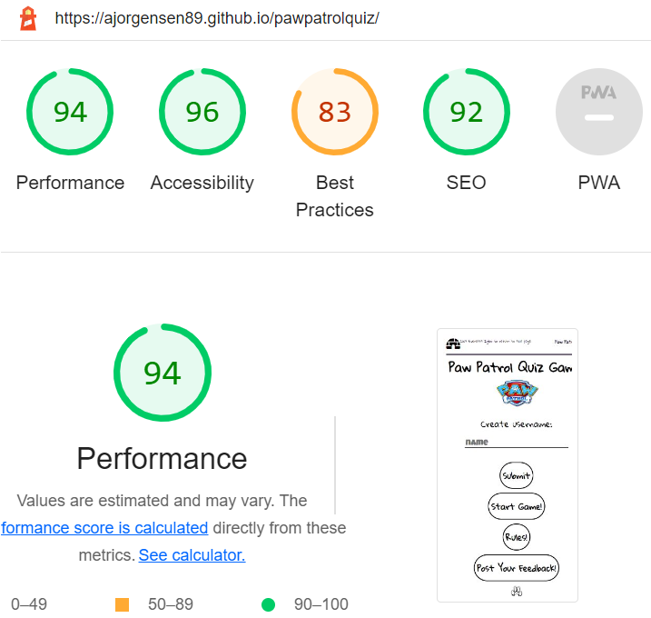
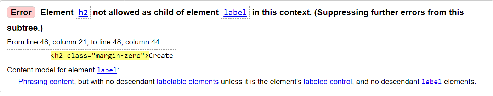
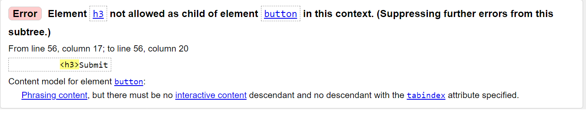
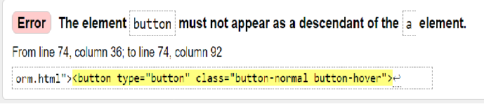
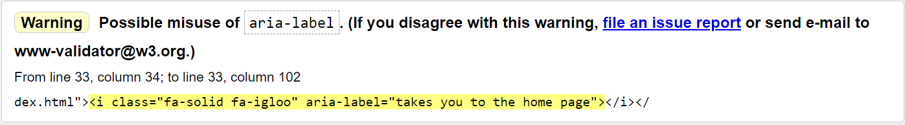
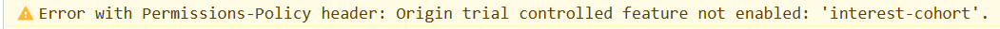

# Testing

## Lighthouse
Definate room for improvement on the site in regards to best practises which can be seen on a Lighthouse report.
The Lighthouse report is used to test the website on areas such as performance, best practise, search engine optimization and accessibility. 

***
## HTML
Testing HTML can be done with the use of [HTML Validator W3](https://validator.w3.org/).
It throws out errors that next correcting. Here are some examples 
**Error** _h2_ element removed from incorrect postion. 
 
**Error** _h3_ element removed from buttons. 
 
**Error** Anchors removed from inside buttons as not accepted. 
 
**Warning** shows incorrect use of aria-labels in the HTML. Removed. 
 

## CSS
The code written for CSS can be tested using [W3C CSS Validator](https://jigsaw.w3.org/css-validator/). It flags any issues with what has been created to help improve the website and make it function correctly.  
 
## JSHint
[JSHint](https://jshint.com/) was used to check javascript while building the project. It would help and flag up errors and suggestions to work on.  
Unneccessary semi-colons were removed and not needed. On one instance, the code stopped working so I placed the semi-colon back in. It also helped indentify incorrectly assigned variable, which helped improve the javascript code. 
While building javascript and code, some items get left behind. The [JSHint](https://jshint.com/) helped removed any unneeded parts that might have been accidentily left in.
 

## Multiple Browers
The website, after being deployed was tested to ensure it ran the wesbite and its content on different broswers. This can be used to test the websites perfermance, search engine optimization and accessibility for future users.
This included [Google Chrome](https://www.google.com/chrome/bsem/download/en_uk/?brand=GEWG&ds_kid=43700066121069608&gclid=692f030e5fb0160ec1ee60b354f800c0&gclsrc=3p.ds&utm_source=bing&utm_medium=cpc&utm_campaign=1605158%20%7C%20Chrome%20Win10%20%7C%20DR%20%7C%20ESS01%20%7C%20EMEA%20%7C%20GB%20%7C%20en%20%7C%20Desk%20%7C%20SEM%20%7C%20BKWS%20-%20EXA%20%7C%20Txt&utm_term=chrome%20browser&utm_content=Desk%20%7C%20BKWS%20-%20EXA%20%7C%20Txt%20~%20Browser%20-%20NEW&gclid=692f030e5fb0160ec1ee60b354f800c0&gclsrc=3p.ds), [Microsoft Edge](https://www.microsoft.com/en-us/edge/home) and [Opera](https://www.opera.com/).
 
***

### Remaining warning 
Discussed with tutor support through Code Institute Student support. Error is from Github Side.

[Back to Top](#testing)
***
***